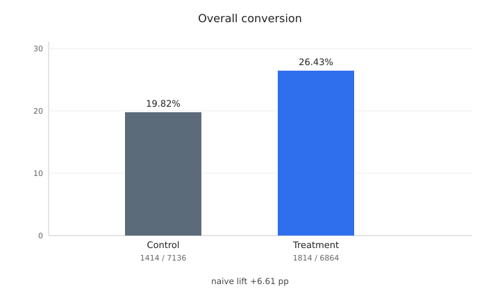
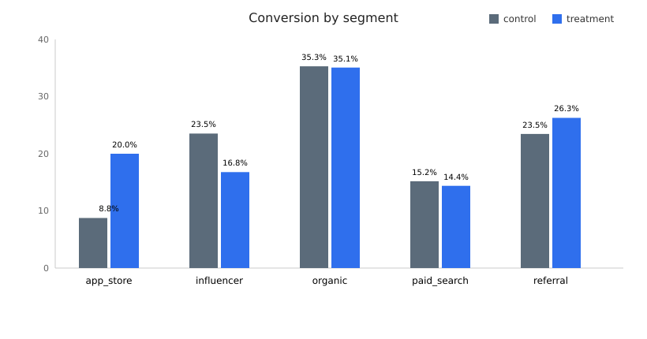
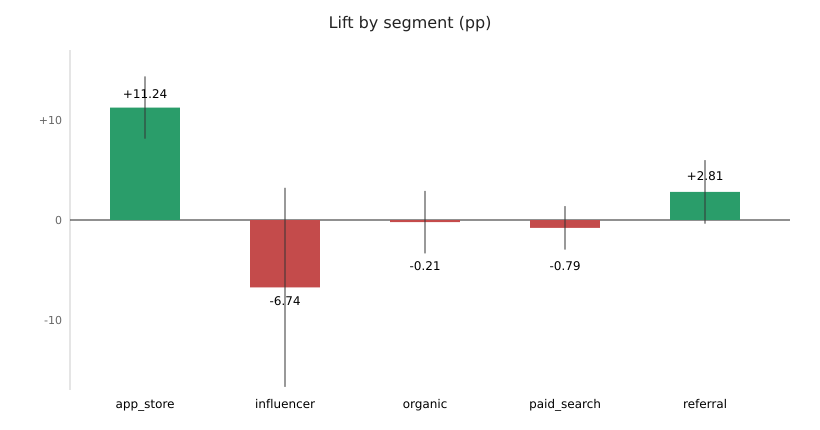
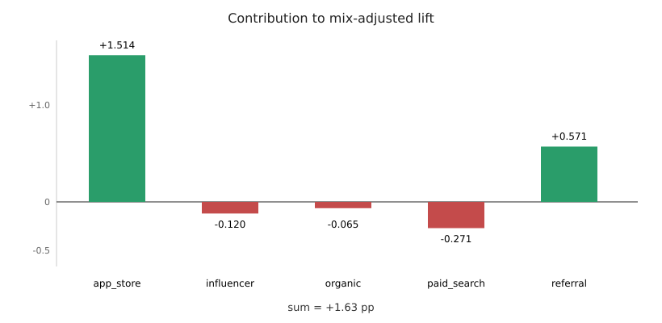
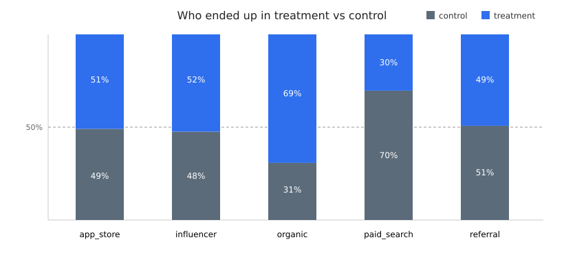

# Onboarding experiment

Looked at `experiment_results.csv` (14,000 users, one row each). No missing values, no duplicate user_ids, variant is only control/treatment, converted is 0/1. File is clean. The weirdness is in how traffic was split, not in dirty rows.

## 1. Naive lift

Control: 1,414 / 7,136 = 19.8150%
Treatment: 1,814 / 6,864 = 26.4277%

Difference: **+6.6127 percentage points**

That's the number leadership is reacting to. It is a rate difference, not a relative lift.

## 2. Same thing by segment

| Segment | Control N | Control CR | Treatment N | Treatment CR | Lift |
|---|---:|---:|---:|---:|---:|
| app_store | 925 | 8.76% | 960 | 20.00% | +11.24 pp |
| influencer | 119 | 23.53% | 131 | 16.79% | -6.74 pp |
| organic | 1298 | 35.29% | 2917 | 35.07% | -0.21 pp |
| paid_search | 3353 | 15.18% | 1459 | 14.39% | -0.79 pp |
| referral | 1441 | 23.46% | 1397 | 26.27% | +2.81 pp |

The segment I would not trust is **influencer**. 250 users total. Observed lift is -6.74 pp but the 95% CI is about [-16.69, +3.22] pp. That crosses zero (p ≈ 0.18). 22 conversions vs 28 is not enough to say the new flow hurts this channel.

## 3. Mix-adjusted lift

Weight each segment's own lift by that segment's share of all 14,000 users.

| Segment | Share of all users | Lift | Contribution |
|---|---:|---:|---:|
| app_store | 13.46% | +11.24 pp | +1.514 pp |
| influencer | 1.79% | -6.74 pp | -0.120 pp |
| organic | 30.11% | -0.21 pp | -0.065 pp |
| paid_search | 34.37% | -0.79 pp | -0.271 pp |
| referral | 20.27% | +2.81 pp | +0.571 pp |
| **total** | 100% | | **+1.63 pp** |

Exact sum is +1.6289 pp, so **+1.63 pp**.

This is so much smaller than +6.61 because treatment and control are not the same mix of sources. Organic already converts at ~35% on the old flow, and 69% of organic users landed in treatment. Paid search converts at ~15% on the old flow, and 70% of those users stayed in control. So the topline is partly "treatment got more of the high-converting channel," not "the new flow added 6.61 pp for a typical user."

## 4. Where the new flow actually looks better

**app_store.**

81/925 vs 192/960. +11.24 pp. Almost even split (925 vs 960). 95% CI [+8.13, +14.36] pp. p ≈ 1.6e-12. That's the only cell I would call a real, meaningful gain.

Referral is +2.81 pp but the CI is [-0.37, +5.99] pp (p ≈ 0.083). Directionally fine, not enough to ship on. Organic and paid_search are flat.

## 5. Assignment

| Segment | Control | Treatment |
|---|---:|---:|
| app_store | 49.1% | 50.9% |
| influencer | 47.6% | 52.4% |
| organic | 30.8% | 69.2% |
| paid_search | 69.7% | 30.3% |
| referral | 50.8% | 49.2% |
| overall | 51.0% | 49.0% |

Overall looks like a coin flip. Organic and paid_search do not. I don't know if that was a staged rollout, a flag rule, or a bug. The CSV cannot tell. If they meant 50/50 inside every segment, someone should look at the assignment config before a global rollout. That imbalance is also why Q1 and Q3 disagree.

## What I would do

Don't roll this out to everyone off the +6.61 pp slide. Check the organic / paid_search split. If assignment is fine, ship the new flow for app_store and keep a holdout. Ignore the influencer -6.74 until there is more data.

## How I got here

- Loaded the csv, checked nulls, dups, allowed values. 14000 unique users.
- Overall rates first. 7136 / 6864 and 1414 / 1814.
- Broke it by segment. app_store jumps, organic and paid_search don't.
- Looked at treatment share inside each segment. Organic/paid_search imbalance is visible from the raw counts.
- Mix-adjusted lift using population shares, then added the five contribution terms to confirm +1.63.
- Unpooled CIs so influencer and app_store could be compared without guessing.
- Did not bother with a logistic model. The 2x2 tables already say the same thing.

`python analyze.py --csv experiment_results.csv` rebuilds the numbers and charts.
